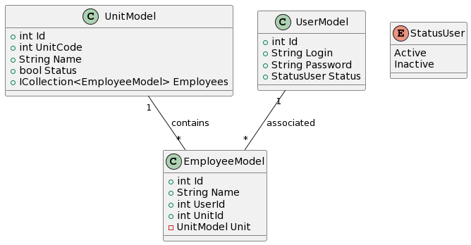

# Sistema de Gestão de Colaboradores e Unidades em C# com PostgreSQL

Este é um projeto de backend que implementa um Sistema de Gestão de Colaboradores e Unidades, utilizando o PostgreSQL como banco de dados.

Funcionalidades:

- Cadastro de Usuário: Os usuários devem ser cadastrados com um código único, login, senha e status (ativo ou inativo).
- Atualização de Informações de Usuários: É possível atualizar as informações de usuário, somente senha e status (ativo ou inativo).
- Listagem de Usuários: O sistema oferece a funcionalidade de listar todos os usuário cadastrados, exibindo seus login e status. Deve também permitir uma consulta apenas por status.
- Cadastro de Colaboradores: Os colaboradores devem ser cadastrados com um código único, nome e relacionados a uma unidade específica. Todo colaborador dever ter um usuário relacionado.
- Atualização de Informações de Colaboradores: É possível atualizar as informações de colaboradores, incluindo o nome e a unidade à qual estão associados.
- Remoção de Colaboradores: Os colaboradores podem ser removidos do sistema.
- Listagem de Colaboradores: O sistema oferece a funcionalidade de listar todos os colaboradores cadastrados, exibindo seus códigos, nomes e unidades associadas.
- Cadastro de Unidades: O sistema permite o cadastro de unidades, associando um ID único, um código de unidade único e um nome à unidade.
- Atualização de Informações de Unidades: As unidades podem ser inativadas, e quando inativadas não podem permitir a inclusão de novos colaboradores.
- Listagem de Unidades: O sistema deve permitir listar todas as unidades cadastradas e todos os colaboradores relacionados.

Diferenciais:

- Utilização do Docker para criação do banco de dados.
- Criar autenticação via Bearer token.

@startuml

class UnitModel {
+int Id
+int UnitCode
+String Name
+bool Status
+ICollection<EmployeeModel> Employees
}

class UserModel {
+int Id
+String Login
+String Password
+StatusUser Status
}

class EmployeeModel {
+int Id
+String Name
+int UserId
+int UnitId
-UnitModel Unit
}

UnitModel "1" -- "*" EmployeeModel : contains
UserModel "1" -- "*" EmployeeModel : associated

enum StatusUser {
Active
Inactive
}

@enduml

**Testes**

- Cadastro de Usuário: Os usuários devem ser cadastrados com um código único, login, senha e status (ativo ou inativo).
- Atualização de Informações de Usuários: É possível atualizar as informações de usuário, somente senha e status (ativo ou inativo).
- Listagem de Usuários: O sistema oferece a funcionalidade de listar todos os usuário cadastrados, exibindo seus login e status. Deve também permitir uma consulta apenas por status.

- Cadastro de Colaboradores: Os colaboradores devem ser cadastrados com um código único, nome e relacionados a uma unidade específica. Todo colaborador dever ter um usuário relacionado.
- Atualização de Informações de Colaboradores: É possível atualizar as informações de colaboradores, incluindo o nome e a unidade à qual estão associados.
- Remoção de Colaboradores: Os colaboradores podem ser removidos do sistema.
- Listagem de Colaboradores: O sistema oferece a funcionalidade de listar todos os colaboradores cadastrados, exibindo seus códigos, nomes e unidades associadas.

- Cadastro de Unidades: O sistema permite o cadastro de unidades, associando um ID único, um código de unidade único e um nome à unidade.
- Atualização de Informações de Unidades: As unidades podem ser inativadas, e quando inativadas não podem permitir a inclusão de novos colaboradores.
- Listagem de Unidades: O sistema deve permitir listar todas as unidades cadastradas e todos os colaboradores relacionados.

